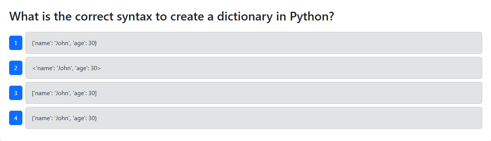

# CICD Demo 

## Description
this project is for demonstration purposes only. Use this project to demo a CICD pipeline! You can also visit the URL and take a coding Quiz.
[Live Application](https://techquiz-dga7.onrender.com) 

## Table of Contents
- [Installation](#installation)
- [Usage](#usage)
- [Contributing](#contributing)
- [Tests](#tests)
- [Questions](#questions)
- [License](#license)

## Installation
To take te Quiz simply visit the url. To view the pipeline go to the actions tab! 

## Usage
Use the project as a demonstration of GitHub actions and CICD workflow. 

## License
This project is licensed under the MIT license.
[MIT](https://opensource.org/licenses/MIT)

## Contributing
add more pipeline tests! 

## Tests
The test are ran in git hub actions after a pull request is made! 

## Questions
If you have any questions, please feel free to contact me at codega366@gmail.com . You can also find me on GitHub at [CodeGa366]
